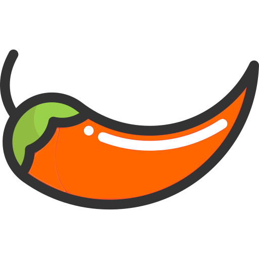

<div align="center">
  <picture>
    
  </picture>
<br>

<h2>Chilli</h2>

[](https://github.com/habedi/chilli/actions/workflows/tests.yml)
[](https://www.codefactor.io/repository/github/habedi/chilli)
[](https://ziglang.org/download/)
[](https://habedi.github.io/chilli/)
[](https://github.com/habedi/chilli/tree/main/examples)
[](https://github.com/habedi/chilli/releases/latest)
[](https://github.com/habedi/chilli/blob/main/LICENSE)

A microframework for creating command-line applications in Zig

</div>

---

Chilli is a lightweight command-line interface (CLI) framework for the Zig programming language.
Its goal is to make it easy to create structured, maintainable, and user-friendly CLIs with minimal boilerplate,
while being small and fast, and not getting in the way of your application logic.

### Features

- Provides a simple, low-overhead, declarative API for building CLI applications
- Supports nested commands, subcommands, and aliases
- Provides type-safe parsing for flags, positional arguments, and environment variables
- Supports generating automatic `--help` and `--version` output with custom sections
- Uses a shared context to pass application state
- Written in pure Zig with no external dependencies

> [!IMPORTANT]
> Chilli is in early development so the API may (slightly) change in the newer releases.
> Please use the [issues page](https://github.com/habedi/chilli/issues) to report bugs or request features.

---

### Getting Started

You can add Chilli to your project and start using it by following the steps below.

#### Installation

Run the following command in the root directory of your project to download Chilli:

```sh
zig fetch --save=chilli "https://github.com/habedi/chilli/archive/<branch_or_tag>.tar.gz"
```

Replace `<branch_or_tag>` with the desired branch or tag, like `main` or `v0.1.0`.
This command will download Chilli and add it to Zig's global cache and update your project's `build.zig.zon` file.

#### Adding to Build Script

Next, modify your `build.zig` file to make Chilli available to your build target as a module.

```zig
const std = @import("std");

pub fn build(b: *std.Build) void {
    const target = b.standardTargetOptions(.{});
    const optimize = b.standardOptimizeOption(.{});

    const exe = b.addExecutable(.{
        .name = "your-cli-app",
        .root_source_file = b.path("src/main.zig"),
        .target = target,
        .optimize = optimize,
    });

    // 1. Get the dependency object from the builder
    const chilli_dep = b.dependency("chilli", .{});

    // 2. Get chilli's top-level module
    const chilli_module = chilli_dep.module("chilli");

    // 3. Add the module to your executable so you can @import("chilli")
    exe.root_module.addImport("chilli", chilli_module);

    b.installArtifact(exe);
}
```

#### Using Chilli in an Application

Finally, you can `@import("chilli")` and start using it in your Zig application.

```zig
const std = @import("std");
const chilli = @import("chilli");

// A function for our command to execute
fn greet(ctx: chilli.CommandContext) !void {
    const name = try ctx.getFlag("name", []const u8);
    const excitement = try ctx.getFlag("excitement", u32);

    std.print("Hello, {s}", .{name});
    var i: u32 = 0;
    while (i < excitement) : (i += 1) {
        std.print("!", .{});
    }
    std.print("\n", .{});
}

pub fn main() anyerror!void {
    var gpa = std.heap.GeneralPurposeAllocator(.{}){};
    defer _ = gpa.deinit();
    const allocator = gpa.allocator();

    // Create the root command for your application
    var root_cmd = try chilli.Command.init(allocator, .{
        .name = "your-cli-app",
        .description = "A new CLI built with Chilli",
        .version = "v0.1.0",
        .exec = greet, // The function to run
    });
    defer root_cmd.deinit();

    // Add flags to the command
    try root_cmd.addFlag(.{
        .name = "name",
        .shortcut = 'n',
        .description = "The name to greet",
        .type = .String,
        .default_value = .{ .String = "World" },
    });
    try root_cmd.addFlag(.{
        .name = "excitement",
        .type = .Int,
        .description = "How excited to be",
        .default_value = .{ .Int = 1 },
    });

    // Hand control over to the framework
    try root_cmd.run(null);
}
```

---

### Documentation

You can use the `make docs` command to generate the API documentation for Chilli.
This will generate HTML documentation in the `docs/api` directory, which you can serve locally with `make serve-docs`
and view in your web browser at `http://localhost:8000/index.html`.

### Examples

Check out the [examples](examples/README.md) directory for examples of how Chilli can be used to build a variety of CLI
applications.

### Feature Roadmap

-   [x] **Command Structure**
    -   [x] Nested commands and subcommands
    -   [x] Command aliases and single-character shortcuts
    -   [x] Persistent flags (flags on parent commands are available to children)

-   [x] **Argument & Flag Parsing**
    -   [x] Long flags (`--verbose`), short flags (`-v`), and grouped boolean flags (`-vf`)
    -   [x] Positional Arguments (supports required, optional, and variadic)
    -   [x] Type-safe access for flags and arguments (e.g., `ctx.getFlag("count", i64)`)
    -   [x] Reading flag values from environment variables

-   [x] **Help & Usage Output**
    -   [x] Automatic and context-aware `--help` flag
    -   [x] Automatic `--version` flag
    -   [x] Clean, aligned help output for commands, flags, and arguments
    -   [x] Grouping subcommands into custom sections

-   [x] **Developer Experience**
    -   [x] Simple, declarative API for building commands
    -   [x] Named access for all flags and arguments
    -   [x] Shared context data for passing application state
    -   [ ] Deprecation notices for commands or flags
    -   [ ] Built-in TUI components (like spinners and progress bars)
    -   [ ] Automatic command history and completion

---

### Contributing

See [CONTRIBUTING.md](CONTRIBUTING.md) for details on how to make a contribution.

### License

Chilli is licensed under the MIT License (see [LICENSE](LICENSE)).

### Acknowledgements

* The logo is from [SVG Repo](https://www.svgrepo.com/svg/45673/chili-pepper).
